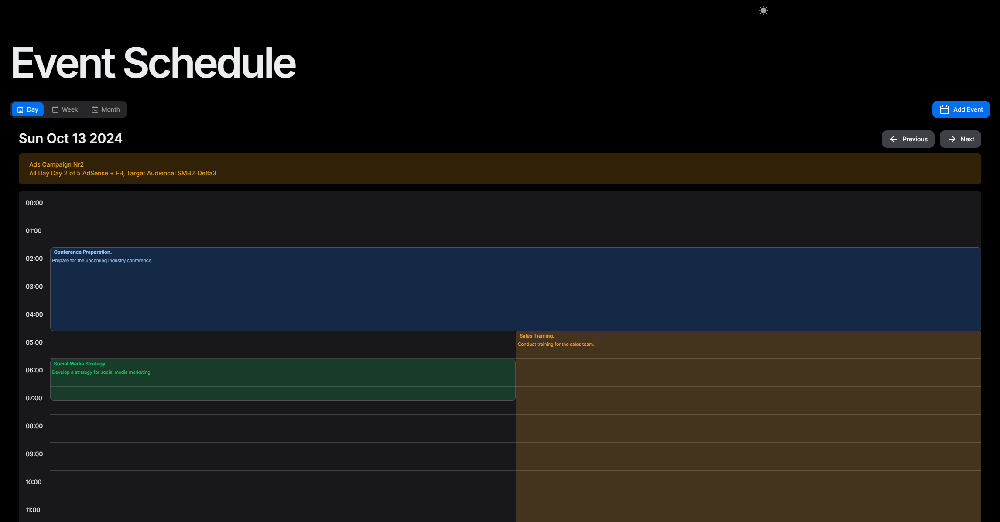
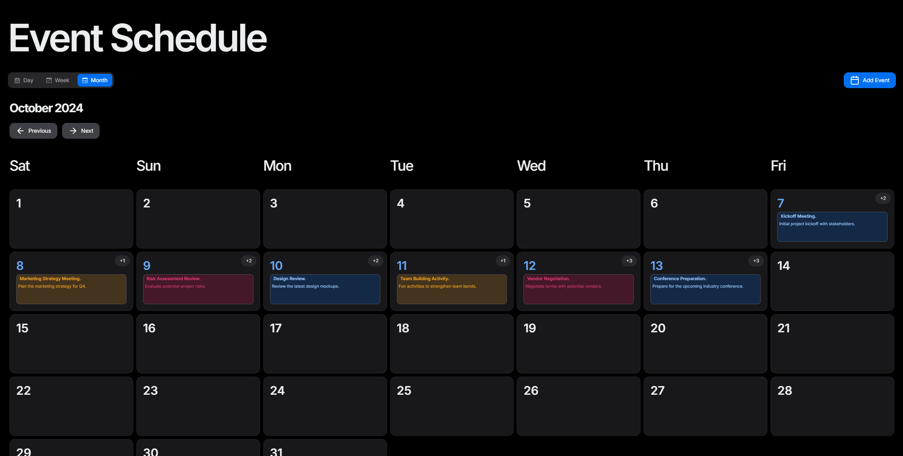
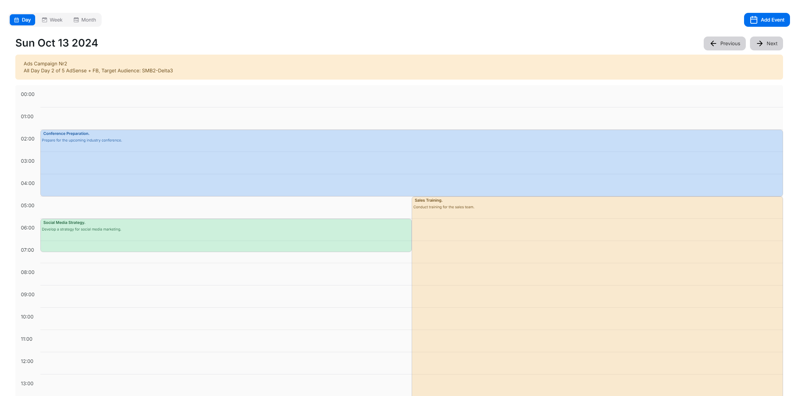

# Scheduler Library for React

Welcome to the **Scheduler Library**! This React-based scheduling library helps you manage events across daily, weekly, and monthly views with customizable modals and smooth animations.

## Table of Contents
- [Features](#features)
- [Installation](#installation)
- [Usage](#usage)
  - [Scheduler Wrapper](#scheduler-wrapper)
  - [Views Explained](#views-explained)
- [Context Provider Setup](#context-provider-setup)
  - [Handlers Explained](#handlers-explained)
  - [Getters Explained](#getters-explained)
- [Custom Modals and Styling](#custom-modals-and-styling)
- [Contributing](#contributing)
- [License](#license)

---

## Features
- **Daily, Weekly, and Monthly Views**: Navigate through events by day, week, or month.
- **Add, Update, Remove Events**: Manage events easily with modals and state management.
- **Smooth Animations**: Utilize `framer-motion` for smooth transitions.
- **Custom Event Styling**: Adjust layout dynamically based on event overlap and size.
- **Context Management**: Use the Scheduler context with React's `useReducer`.
- **Integration with Modals**: Support for `@nextui-org` components and custom modals.

---

## Installation

To get started, clone the repository from GitHub:

```bash
git clone https://github.com/Mina-Massoud/next-ui-full-calendar.git
npm install
```

---

## Demo








## Usage

### Scheduler Wrapper

To use the scheduler in your project, call the `SchedulerView` inside a wrapper component:

```javascript
import React from "react";
import SchedulerView from "../view/schedular-view";

export default function SchedulerWrapper() {
  return (
    <div className="w-full">
      <h1 className="tracking-tighter font-semibold text-8xl mb-10">
        Event Schedule
      </h1>
      <SchedulerView />
    </div>
  );
}
```

This wrapper ensures the **SchedulerView** is correctly rendered inside your component tree.

---

## Views Explained

The **Scheduler Library** provides multiple views to efficiently manage events across different time frames.

### 1. **Daily View**
Displays events for a specific day, broken down into hourly slots.

```javascript
import DailyView from './components/DailyView';

function App() {
  return <DailyView />;
}
```
- **Usage**: Ideal for managing events that span hours.
- **Feature**: Shows a timeline with adding event functionality.

### 2. **Weekly View**
Shows a week's worth of events, helping you get an overview of tasks across multiple days.

```javascript
import WeeklyView from './components/WeeklyView';

function App() {
  return <WeeklyView />;
}
```
- **Usage**: Perfect for planning meetings and activities over several days.
- **Feature**: Displays overlapping events side-by-side with dynamic widths.

### 3. **Monthly View**
Provides an overview of events for an entire month.

```javascript
import MonthView from './components/MonthView';

function App() {
  return <MonthView />;
}
```
- **Usage**: Useful for scheduling long-term events or campaigns.
- **Feature**: Supports compact event previews with a "Show More" option.

---

## Context Provider Setup

Wrap your application with the `SchedulerProvider` to manage event state and actions.

### Example:

```javascript
import { SchedulerProvider } from './context/SchedulerContext';
import SchedulerWrapper from './components/SchedulerWrapper';

function App() {
  return (
    <SchedulerProvider>
      <SchedulerWrapper />
    </SchedulerProvider>
  );
}
```

---

## Handlers Explained

Handlers define logic for managing event styling. This ensures that overlapping events display correctly and are positioned dynamically within the scheduler view.

```javascript
handlers.handleEventStyling(event, dayEvents);
```

### Breakdown:
- **`handleEventStyling(event, dayEvents)`**: 
  - **Calculates**: Top position and height for each event.
  - **Adjusts**: The event's position if it overlaps with others.
  - **Returns**:  
    - `height`: Event height based on duration.  
    - `top`: Vertical offset for event positioning.  
    - `left`: Horizontal position for overlapping events.  
    - `zIndex`: Stacking order of events.  
    - `maxWidth`, `minWidth`: Widths for overlapping events.

---

## Getters Explained

Getters provide utility methods to retrieve and manipulate scheduling data.

### List of Getters:

1. **`getDaysInMonth(month, year)`**:  
   - Returns an array of days in a month, each with its corresponding events.
   ```javascript
   const days = getters.getDaysInMonth(9, 2024);
   ```

2. **`getEventsForDay(day, currentDate)`**:  
   - Retrieves the list of events for a specific day.
   ```javascript
   const events = getters.getEventsForDay(12, new Date());
   ```

3. **`getDaysInWeek(week, year)`**:  
   - Provides an array of `Date` objects for a given week.
   ```javascript
   const weekDays = getters.getDaysInWeek(42, 2024);
   ```

4. **`getWeekNumber(date)`**:  
   - Calculates the week number for a specific date.
   ```javascript
   const weekNumber = getters.getWeekNumber(new Date());
   ```

5. **`getDayName(day)`**:  
   - Returns the name of the day (e.g., "Mon").
   ```javascript
   const dayName = getters.getDayName(1); // Output: "Mon"
   ```

---

## Custom Modals and Styling

The library integrates with `@nextui-org` for modals and supports event management through user interactions.

### Example Modal Usage:

```javascript
showModal({
  title: "Add Event",
  body: <AddEventModal />,
  getter: async () => ({
    startDate: new Date(),
    endDate: new Date(Date.now() + 60 * 60 * 1000), // 1 hour later
  }),
});
```

---

## Contributing

We are actively seeking contributors to improve the **Our Scheduler Library**! If you'd like to contribute:
1. Fork the repository.
2. Create a new branch for your feature.
3. Submit a pull request for review.

We appreciate all contributions, whether you're fixing bugs, enhancing documentation, or introducing new features!

---

## License

This project is licensed under the MIT License.

---

Thank you, feel free to follow me on linkedIn : https://www.linkedin.com/in/mina-melad/
contact with me and discover my portfolio : https://mina-massoud.onrender.com/
